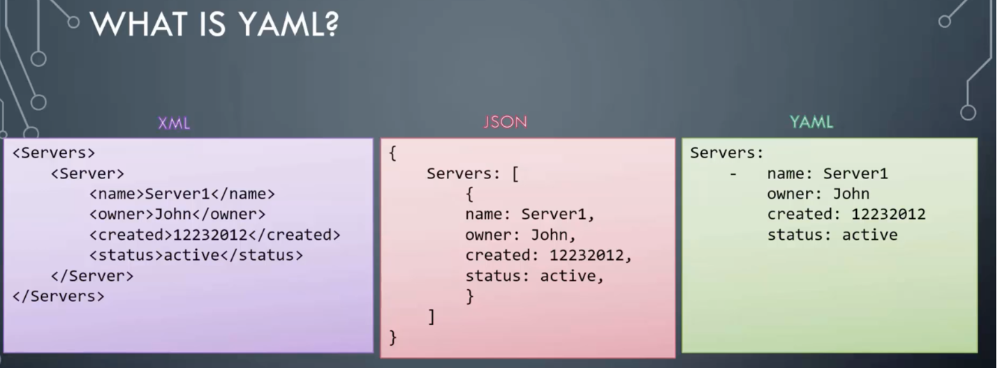
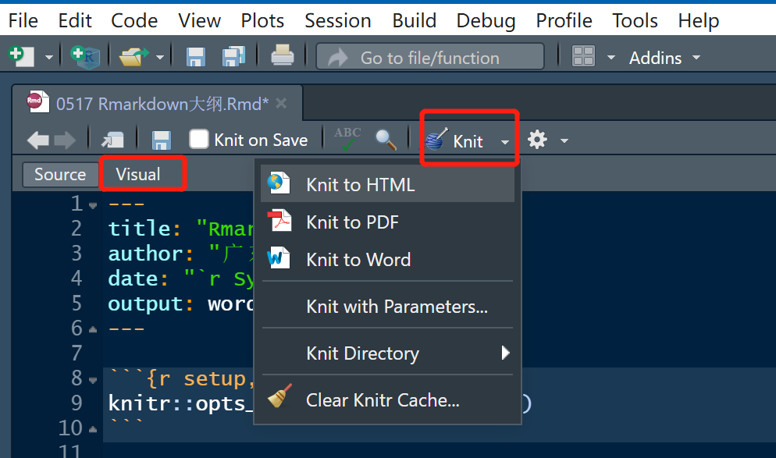

```{r setup, include=FALSE}
knitr::opts_chunk$set(echo = FALSE)
```

## 1. 课程概览

- markdown的基本概念
- rmarkdown使用方法
- 案例实践

## 2. Markdown
- 2.1什么是Markdown
- 2.2 Markdown的优势
- 2.3 类似Markdown的工具

## 2.1什么是Markdown

- Markdown 是一种**轻量级标记语言**
- 发明之初旨在简化HTML内容的书写方式
- 2004 年由约翰·格鲁伯（John Gruber）创建
- 可导出*HTML、Word、图像、PDF、Epub* 等格式
- 文档后缀为 *.md, .markdown*


## 2.2 Markdown的优势

| 优势点       | 描述                         |
|--------------|------------------------------|
| 简单易学     | 文本标记，无需复杂标签       |
| 跨平台       | 多种系统和编辑器可用         |
| 可读性强     | 清晰明了，易于阅读           |
| 兼容性高     | 可转换为多种格式             |
| 纯文本格式   | 易于移植和版本控制           |
| 写作效率高   | 快速编写，减少排版时间       |
| 自定义性强   | 支持CSS样式自定义            |
| 社区支持丰富 | 教程和工具丰富，易于获取帮助 |


## 2.3 类似Markdown的工具

| 工具名称      | 简介             | 主要功能               |
|---------------|------------------|------------------------|
| **RMarkdown** | Markdown + R代码 | 嵌入R代码，动态内容    |
| **Typora**    | 所见即所得       | 实时预览，导出多种格式 |
| VS Code       | 代码编辑器       | 实时预览，插件扩展     |
| Haroopad      | 跨平台编辑器     | 实时预览，兼容GFM      |
| Atom          | GitHub文本编辑器 | 语法高亮，插件丰富     |
| Notion        | 笔记应用         | Markdown编辑，任务协同 |

<!-- 除了 Markdown，还有以下一些类似的文本标记语言和编辑器，它们也提供了简洁、易读和跨平台的特性： -->
<!-- -   **Typora**：一款所见即所得的 Markdown 编辑器。支持多种导出格式。 -->

<!-- -   **AsciiDoc**：支持更多格式和特性，适合大型文档制作。 -->

<!-- -   **Visual Studio Code (VS Code)**：功能丰富的代码编辑器。支持 Markdown 编辑和预览。 -->

<!-- -   **Atom**：可定制的文本编辑器。支持 Markdown 预览和插件扩展。 -->

<!-- -   **StackEdit**：在线 Markdown 编辑器。支持云同步和多种导出格式。 -->

## 3. R Markdown

- 3.1 R markdown与markdown异同
- 3.2 R包安装
- 3.3 文档创建

## 3.1 R markdown与markdown异同
|     项目     | RMarkdown          | Markdown       |
|--------------|--------------------|----------------|
| **定义**     | Markdown + R代码   | 纯文本格式     |
| **R代码**    | 支持               | 不支持         |
| **动态内容** | 可以               | 静态           |
| **输出格式** | HTML, PDF, Word等  | 主要为HTML     |
| **应用场景** | 数据分析, 科研报告 | 文档编写, 笔记 |
| **集成性**   | 与RStudio集成      | 广泛编辑器支持 |
| **涉及知识** | Markdown + R       | 仅Markdown     |
| **扩展性**   | 较强（R包支持）    | 较好           |

## 3.2 R包安装

-   install.packages("rmarkdown") \#安装rmarkdown包
-   install.packages("tinytex") \# 安装 tinytex(输出 PDF 格式的文档)

如果 TinyTeX 下载慢，可直接在https://github.com/yihui/tinytex-releases/releases 下载后再安装。

## 3.3 文档创建

- **文档创建流程**： 在 RStudio 菜单栏中选择 File -\> New File -\> R Markdown，点击 OK

- **套用模板创建文档**： "From Template"，模板通常包括**头部信息（如YAML元数据）、样式表（CSS）以及可能的自定义脚本和HTML代码**，映射了特定的标题、页眉、页脚、样式等。推荐下载**prettydoc、rmdformats包**获取一些常见的模板。

## 3.3 文档创建


## 3.4 文档结构

- 3.4.1 YAML

YAML的全称是 "YAML Ain't Markup Language"。它是一种用于配置文件的人可读的数据序列化语言，可理解成是一种存储数据的文件格式，类似json和xml。 通常用于配置文件，如 R Markdown 文档的元数据头部。

- 3.4.2 .rmd文档结构


## 3.4.1 YAML




## 3.4.2 .rmd文档结构

-  YAML文档元数据与设置

-  普通文本使用Markdown语法

-  插入R代码块

## 3.4.2 .rmd文档结构


## 3.5 文档编译


## 3.5.1 R Markdown → Markdown（通过knitr）

- **knitr包的作用**：`knitr`将R代码块从R Markdown文档中提取，并在R环境执行。

- **代码执行**：`knitr`执行R代码块，输出结果及可能的错误或警告信息插入到Markdown文本。

- **生成Markdown文件**：执行完R代码后，`knitr`生成Markdown文件，包含原始文档内容和代码结果。

- **自定义选项**：`knitr::opts_chunk$set()`设置代码块选项，如隐藏代码、设置警告和消息的显示等。

- 点击**Knit按钮**等于调用`rmarkdown::render()`

## 3.5.1 R Markdown → Markdown（通过knitr）



## 3.5.2 Markdown → 多种格式（Pandoc）

- **Pandoc的作用**：读取Markdown文件将其转换多种不同的文档格式。

- **输出格式**：在YAML指定输出格式，将Markdown文件转换成HTML、PDF、Word等格式。

- **转换过程**：Pandoc会读取Markdown文件，并根据指定的输出格式进行转换。

- **自定义模板**：用户可以自定义输出文档的样式和布局。

- **转换参数**：了丰富的命令行参数进行细致的控制。

- **自动化编译**：RStudio"Knit"按钮一键编译。


## 4. R Markdown语法

:::::: {.columns}
::: {.column}
- 4.1 标题
- 4.2 段落
- 4.3 列表
- 4.4 强调
- 4.5 代码块
:::

::: {.column}
- 4.6 链接
- 4.7 图片
- 4.8 表格
- 4.9 数学公式
- 4.10 分页符和分割线
:::
::::::


## 4.1 标题
使用 `#` 符号来定义标题，`#` 的数量决定了标题的级别。

``` markdown
# 一级标题
## 二级标题
### 三级标题
```

## 4.1 标题

下面为"临床试验药物A与药物B的疗效对比"的例子：

``` markdown
# 临床试验药物A与药物B的疗效对比
## 摘要
  本研究旨在比较药物A和药物B在治疗某种疾病上的疗效。通过对临床试验数据的分析，我们得出了以下结论...
## 数据和方法
### 数据来源
#### 基本信息
#### 基线病情
```
## 4.2 段落

- **两个空格加回车**

在一行的末尾加上两个空格，然后敲回车。Markdown会将两个空格转换为一个换行。

**示例：**

这是第一行。*空格* *空格*
*回车*
这是第二行。

## 4.2 段落

- **使用HTML的`<br>`标签**

在需要换行的地方使用`<br>`标签。

**示例：**

这是第一行。\<br\>
这是第二行。

## 4.2 段落

- **段落换行**

如果你想开始一个新的段落，只需要在两行文本之间留出一个空行。

**示例：**

``` markdown
这是一个段落。

这是另一个段落。
```

## 4.2.2 代码块中的换行

在代码块中，通常不需要做特殊处理，因为代码块内的换行会被保留。

**示例：**

```{r echo=TRUE}
# 这是一个R代码块
print("这是第一行输出。") # 这会在控制台输出
print("这是第二行输出。") # 这也会在控制台输出
```

这两行print语句会在控制台输出时各自占据一行。

## 4.2.3 段落或换行的注意事项

- 在R Markdown的普通文本，连续空格在渲染时通常会被转换成一个空格。如需创建空格效果，可能要用非断行空格（`&nbsp;`）或者HTML标签。

- 换行符（`\n`）通常不会被识别为换行命令，所以不要使用`\n`来换行。


## 4.3 列表

-   无序列表使用 `-`、`*` 或 `+` 符号。
-   有序列表使用数字加 `.`。
-   任务列表（GFM扩展）用`- [ ]`或用`- [x]`。


## 4.3.1 无序列表

**公共卫生预防措施**

-   **戴口罩：**在公共场所和人群密集区域佩戴口罩，减少呼吸道传染病的传播。
-   **勤洗手：**定期用肥皂和水洗手，或使用含酒精的手部消毒液。
-   **保持社交距离：**与他人保持至少1米的距离，减少接触传播的风险。
-   **避免聚集：**减少参加大型聚会和活动的次数，降低感染风险。

## 4.3.2 有序列表

**临床试验阶段**

1.  **预备阶段**：设计试验方案，确定研究对象、干预措施、样本量等。
2.  **招募阶段**：按照试验方案招募受试者，并进行基线评估。
3.  **干预阶段**：对受试者实施干预措施，并记录相关数据。
4.  **随访阶段**：按照试验方案对受试者进行随访，收集干预后的数据。
5.  **数据分析与报告**：对收集到的数据进行统计分析，撰写研究报告或论文。

## 4.3.3 任务列表（GFM扩展）

扩展语法GFM（GitHub Flavored Markdown）是GitHub在标准Markdown语法基础上扩展的一系列语法特性，它为开发者提供了更丰富的文本表达方式。GFM支持任务列表（Task Lists）的语法，可用`- [ ]`表示一个未完成的任务，使用`- [x]`表示一个已完成的任务。例如：

**公共卫生应急响应计划**

-   [x] 设立应急响应小组，明确职责和分工。
-   [ ] 开展应急演练，检验预案的可行性和有效性。

已经完成用`- [x]`表示、尚未完成用`- [ ]`表示。

## 4.4 强调

-   粗体文本使用 `**` 或 `__`。
-   斜体文本使用 `*` 或 `_`。

&nbsp;&nbsp;**新药A在治疗高血压方面的疗效显著**。通过一项为期12周的临床试验，我们发现使用新药A治疗的高血压患者，其血压控制率达到了*85%*。与此同时，*患者的生活质量也得到了显著提升*。

## 4.5 代码块

在R Markdown中，代码块是用来嵌入可执行代码的重要部分。这些代码块可以是R代码、Python代码、SQL查询等，取决于你选择的文档引擎和内核。

## 4.5.1 使用方法

R Markdown中可用三个反引号（\`\`\`）来创建一个代码块，并在第一行的反引号后指定代码语言（如`r`、`python`、`sql`等），以便进行语法高亮。

##  **示例：Python代码块**

```{python eval=FALSE, include=FALSE}
# 导入pandas库
import pandas as pd

# 读取数据集（这里假设数据集名为vaccine_data.csv）
vaccine_data = pd.read_csv("vaccine_data.csv")

# 筛选已接种疫苗的人群
vaccinated_group = vaccine_data[vaccine_data['vaccine_status'] == '已接种']

# 计算已接种疫苗人群的平均年龄
mean_age_vaccinated = vaccinated_group['age'].mean()

# 输出结果
print(f"已接种疫苗人群的平均年龄为：{mean_age_vaccinated}")
```

## 4.5.2 代码块属性

RMarkdown代码块设置不同参数来控制代码的执行和输出：

-   `echo`：控制代码是否显示在文档中。
-   `eval`：决定代码是否被执行。
-   `results`：设置执行结果的显示方式。
-   `warning`、`message`、`error`：分别控制警告、消息和错误信息的显示。
-   `cache`：允许代码块的结果被缓存，以提升性能。

## 4.5.3 R 代码执行与输出

-   在 R Markdown 文档中，可以直接嵌入 R 代码，并展示其输出。

```{r echo=TRUE, message=TRUE, warning=TRUE}
# 隐藏代码（echo=FALSE）和消息（message=FALSE）
x <- c(1, 2, 3)
mean(x)
```

例子中，`echo=FALSE` 表示不显示代码本身，`message=FALSE` 表示不显示 R 运行时的消息。

## 4.6 链接

创建超链接的基本语法是使用方括号`[]`包围链接文本，紧接着使用圆括号`()`包围链接地址。

假设我们正在撰写一篇关于"新冠病毒疫苗接种效果分析"的R Markdown文档，并想引用世界卫生组织（WHO）发布的最新报告。我们可以使用以下语法来创建一个链接：

``` markdown
根据[世界卫生组织（WHO）的最新报告](https://www.who.int/publications/m/item/weekly-epidemiological-update---23-august-2023)，新冠病毒疫苗的接种效果在不同人群中有所差异。
```

<!-- ## 4.6 链接 -->

<!-- 在示例中，链接文本是"世界卫生组织（WHO）的最新报告"，而链接地址是`https://www.who.int/publications/m/item/weekly-epidemiological-update---23-august-2023`，读者可以点击这个链接，直接访问WHO发布的最新报告，获取更详细的信息。 -->

<!-- 除了引用外部资源，你还可以使用链接来跳转到文档的其他部分。这对于长篇文档来说非常有用，可以帮助读者快速定位到感兴趣的内容。例如，你可以使用以下语法来创建一个指向文档中某个章节的链接： -->

<!-- 关于R markdown与markdown的对比，请参见[3.1 R markdown与markdown异同](###%203.1%20R%20markdown与markdown异同)。 -->

<!-- 在这个示例中，链接文本是"3.1 R markdown与markdown异同"，而链接地址是一个特殊的标识符`### 3.1 R markdown与markdown异同`。这个标识符对应于文档中某个标题的ID，通过点击这个链接，读者可以快速跳转到该标题所在的位置。 -->

## 4.7 图片

在R Markdown中，图片的插入同样和链接类似，非常简单且直观。

图片可能用于展示网络或本地图像、数据可视化结果、流程图等。

## 4.7.1 插入网络图片

如果有一个图片的有效网络连接（即图片的URL），可以直接使用以下语法来插入它：

``` markdown

```

<!-- 例如，如果想插入一张展示新冠病毒传播路径的流程图，你可以这样做： -->

<!-- ``` markdown -->
<!--  -->
<!-- ``` -->

## 4.7.2 插入本地图片

如果有一个保存在本地文件夹中的图片，可以使用相对路径或绝对路径来引用它，但推荐使用相对路径。

相对路径是相对于你的R Markdown文件所在的位置的路径。例如，如果你的R Markdown文件在`C:/Users/YourName/Documents/Project`文件夹中，而你的图片在`C:/Users/YourName/Documents/Project/Images`文件夹中，那么你可以使用以下语法来插入图片：

``` markdown

```

<!-- 注意，这里的`Images/your-image.png`就是相对于R Markdown文件的相对路径。 -->

## 4.7.3 插入R代码块生成的图片 | **疾病防控案例：传染病监测数据**

```{r echo=TRUE, message=FALSE, warning=FALSE}
library(ggplot2);library(dplyr)
daily_cases <- data.frame(
  Date = seq.Date(from = as.Date("2023-01-01"), to = as.Date("2023-12-31"), by = "day"),
  Cases = rpois(365, 50)  
)

plot(x = daily_cases$Date, y = daily_cases$Cases, type = 'l',
     xlab = "日期", ylab = "新增病例数",
     main = "某种传染病每日新增病例数")

ggplot(data = daily_cases, aes(x = Date, y = Cases)) +
  geom_line() +
    scale_x_date(breaks = "2 month", date_labels = "%Y-%B") +  
  labs(title = "某种传染病每日新增病例数", x = "日期", y = "新增病例数") +
  theme_minimal()
```

## 4.7.3 插入R代码块生成的图片 |**临床案例：治疗方法对患者生存率的影响**

```{r echo=TRUE, message=FALSE, warning=FALSE, paged.print=FALSE}
treatment_data <- data.frame(
  Treatment = factor(c("Treatment A", "Treatment B", "Control")),
  SurvivalRate = c(0.80, 0.90, 0.60)
)
library(ggplot2)
ggplot(treatment_data, aes(x = Treatment, y = SurvivalRate)) +
  geom_bar(stat = "identity", fill = "darkorange") +
  labs(title = "Effect of Treatment on Patient Survival Rate",
       x = "Treatment",
       y = "Survival Rate") +
  theme_minimal()
```


## 4.7.3 插入R代码块生成的图片 |**使用ggplot2 包创建甘特图**

```{r echo=TRUE, message=FALSE, warning=FALSE, paged.print=FALSE}
library(ggplot2);library(dplyr)
activities <- data.frame(
  Activity = c("数据收集与整理", "数据分析", "结果整理与报告撰写", "项目总结与建议提出"),
  Start = as.Date(c("2024-07-01", "2024-08-01", "2025-01-01", "2025-04-01")),
  End = as.Date(c("2024-12-31", "2024-12-31", "2025-03-31", "2025-06-30")))
activities <- activities %>%
  mutate(Activity = factor(Activity, levels = unique(Activity)[order(Start, decreasing = T)]))
gantt_chart <- ggplot(activities, aes(x = Start, xend = End, y = Activity)) +
  geom_segment(aes(color = Activity), size = 14) +  
  scale_x_date(breaks = "2 months", date_labels = "%Y-%m") + 
  theme_minimal() +  
  labs(title = "项目进度甘特图", x = "日期", y = "活动")
print(gantt_chart)
```


## 4.7.4. 调整图片大小

虽然Markdown本身并不直接支持调整图片大小的功能，但可以通过添加`fig.width`和`fig.height`等属性，或者通过HTML标签来实现。

**通过fig.x属性调整图片大小** 如下是在R Markdown代码块中添加`fig.width`和`fig.height`这两个属性来调整图片大小。

## 4.7.4. 调整图片大小

```{r treatment-survival-plot, fig.height=3, fig.width=4, message=FALSE, warning=FALSE}
# 假设的治疗数据
treatment_data <- data.frame(
  Treatment = factor(c("Treatment A", "Treatment B", "Control")),
  SurvivalRate = c(0.80, 0.90, 0.60)
)

# 生成图表
library(ggplot2)
ggplot(treatment_data, aes(x = Treatment, y = SurvivalRate)) +
  geom_bar(stat = "identity", fill = "darkorange") +
  labs(title = "Effect of Treatment on Patient Survival Rate",
       x = "Treatment",
       y = "Survival Rate") +
  theme_minimal()
```

<!-- 在这个代码块中，`{r treatment-survival-plot, fig.width=4, fig.height=3}`这部分是R Markdown的"代码块标签"。在这个标签中，`treatment-survival-plot`是代码块的名称，而`fig.width=4`和`fig.height=3`则是设置图片宽度和高度的属性。这些属性将影响由该代码块生成的图片的大小。 -->

<!-- 请注意，这些尺寸是以英寸为单位的，但你也可以使用其他单位，如厘米（cm）或像素（px），只需将数字后面的单位更改为你想要的即可。例如，`fig.width=10cm`或`fig.height=500px`。 -->

## 4.7.4. 调整图片大小

**通过HTML标签调整图片大小**

``` markdown

```

在这个示例中，`style="width:50%;height:auto;"`用于设置图片的宽度为50%（相对于其容器的宽度），并自动调整高度以保持图片的原始比例。

## 4.8 表格 | 编写表格

可以在 R Markdown 中用 R 代码来直接定义、编写表格，或导入/生成表格。例如用管道符（\|）和短横线（-）来定义一个简单的表格：

```
| 患者ID | 年龄 | 性别 | 诊断结果 | 治疗方法 |
|:------:|:----:|:----:|:--------:|:--------:|
|   1    |  25  |  男  |   癌症   |   手术   |
|   2    |  32  |  女  |  糖尿病  | 药物治疗 |
|   3    |  48  |  男  |  心脏病  | 搭桥手术 |
|   4    |  18  |  女  |   哮喘   |  吸入器  |
|   5    |  55  |  男  |   中风   | 物理治疗 |
```

## 4.8 表格 | **R代码生成表格**


```{r echo=TRUE, message=FALSE, warning=FALSE}
# 手动创建一个临床医学数据示例
clinical_data <- data.frame(
  患者ID = 1:5,
  年龄 = c(25, 32, 48, 18, 55),
  性别 = c("男", "女", "男", "女", "男"),
  诊断结果 = c("癌症", "糖尿病", "心脏病", "哮喘", "中风"),
  治疗方法 = c("手术", "药物治疗", "搭桥手术", "吸入器", "物理治疗")
)
# 使用 knitr::kable() 函数来生成Markdown格式的表格
knitr::kable(clinical_data, caption = "临床患者数据（部分）", format = "markdown")
```

<!-- 使用 knitr::kable() 函数来生成Markdown格式的表格。 knitr::kable() 是一个用于生成美观表格的函数，它将数据框(data.frame)或矩阵(matrix)转换为Markdown格式，使得表格在R Markdown文档中能够以整洁的格式呈现。caption 参数用于为表格添加标题。 -->

## 4.8 表格 | **R代码来导入表格**

\`\`\`{r echo=TRUE, message=FALSE, warning=FALSE}
library(readxl)  
Cars_excel_data <- read_excel("tables/Cars Data.xlsx")  
head(Cars_excel_data, 2)  
knitr::kable(Cars_excel_data[4])  
\`\`\`

## 4.9 数学公式

GAM 的基本公式可以表示为：
`g(E[Y|X]) = \alpha + f_1(x_1) + f_2(x_2) + \ldots + f_p(x_p)`
$$ g(E[Y|X]) = \alpha + f_1(x_1) + f_2(x_2) + \ldots + f_p(x_p) $$

<!-- 其中： -->

<!-- -   $Y$ 是响应变量（例如，某种疾病的发病率）。 -->
<!-- -   $X = (x_1, x_2, \ldots, x_p)$ 是预测变量（例如，年龄、性别、环境因素等）。 -->
<!-- -   $g(\cdot)$ 是连接函数，它定义了响应变量的期望值与模型预测值之间的关系。常见的连接函数包括恒等函数（用于线性回归）、对数函数（用于泊松回归）等。 -->
<!-- -   $f_1, f_2, \ldots, f_p$ 是平滑函数，它们捕获了响应变量与每个预测变量之间的非线性关系。这些平滑函数可以是任何形状，从而允许模型适应复杂的数据模式。 -->
<!-- -   $\alpha$ 是截距项。 -->

<!-- 当渲染时，LaTeX 公式将被转换为专业的数学表达式。 -->


<!-- - RMarkdown 支持使用 LaTeX 语法来插入数学公式。 -->

<!-- - RMarkdown 文档中，用 `$$` 符号来插入 LaTeX 格式的数学公式。 -->

## 4.10 分页符和分割线

-   分页符

在 R Markdown 中，通常没有直接的分页符语法来强制在输出文档（如 PDF）中进行分页。但是，当生成 PDF 时，我们可能希望使用 LaTeX 的功能来实现分页。但是，请注意，这通常是在我们使用的特定 R Markdown 模板（如 pandoc 的 LaTeX 模板）中控制的，而不是直接在 R Markdown 文档中。

<!-- 如果用像 bookdown 这样的R包来编写书籍或长文档，则可以使用 `\newpage` 或 `\clearpage` 在 LaTeX 输出中强制分页。 -->

-   分割线

用 HTML 或 Markdown 的语法来添加分割线。

<!-- 以下是示例： -->

<!-- ``` markdown -->
<!-- --- -->

<!-- 这是一条分割线。 -->

<!-- 或用三个或更多的连字符、星号或下划线来创建一条水平线： -->

<!-- *** -->

<!-- 或者 -->

<!-- --- -->

<!-- 或者 -->

<!-- ___ -->
<!-- ``` -->

<!-- 上述这些都将在生成的文档（ HTML、PDF 等）中显示为一条水平线（注意，这些水平线在纯文本输出（如 Markdown 文件）中可能无法正确显示）。 -->

## 4.11 导出文档与分享

RMarkdown 文件可导出为多种格式，包括 HTML、Word、PDF 等。

**1.导出 HTML**

**确保指定输出格式为HTML**：在文件的 YAML 头部中，设置 `output` 为 `html_document`。可以进一步定制输出选项，如选择主题、添加 CSS 样式等。

``` yaml
---
title: "RMarkdown 示例"
author: "你的名字"
date: "2024年5月22日"
output: html_document
---
```

## 4.11 导出文档与分享

**2.导出 HTML**

可以点击 RStudio 工具栏上的 "Knit" 按钮（或使用快捷键 Ctrl + Shift + K），选择 "Knit to HTML"。这将生成一个 HTML 文件，在浏览器中打开。

或者，通过如下代码：

```{rmarkdown eval=FALSE, include=FALSE}
rmarkdown::render(input = "Rmarkdown课件.Rmd",
                   output_format = "html_document",
                   output_file = "output/output.html")
```

## 4.11 导出文档与分享

**3.导出 Word**

``` yaml
---
title: "RMarkdown 示例"
author: "你的名字"
date: "2024年5月22日"
output: word_document
---
```


## 4.11 导出文档与分享

**4.导出 PDF**

要导出为 PDF，通常需要使用 `pdf_document` 或 `latex_document` 格式，并通过 LaTeX 编译器（如 pandoc 或 XeLaTeX）进行转换。

<!-- - (1)**确保已安装 LaTeX 等编译器**： LaTeX ，MiKTeX ，MacTeX 等。 -->

<!-- - (2)**修改输出格式**：在 YAML 头部中，将 `output` 设置为 `pdf_document` 或 `latex_document`。 -->

``` yaml
---
title: "RMarkdown 示例"
author: "你的名字"
date: "2024年5月22日"
output: pdf_document
---
```

## 4.11 导出文档与分享

**5.导出其他格式**

- PowerPoint（`powerpoint_presentation`）
- 幻灯片（`slidy_presentation`、`revealjs::revealjs_presentation`、`beamer_presentation`）
- 电子书（`epub_document`）

<!-- 我们可以通过修改 YAML 头部中的 `output` 字段来指定你想要的输出格式。然后，使用 "Knit" 按钮来生成对应的文件。 -->

<!-- 请注意，某些格式可能需要额外的依赖项或工具链来正常工作。例如，要导出为电子书，可能需要安装 Calibre 或其他电子书编辑工具。 -->


## 5. R Markdown 应用与拓展

-  科研文章撰写

-  数据分析与报告

<!-- 允许一体化完成数据处理、分析、可视化及报告编写。可以直接在文档中嵌入R代码块，R Markdown将自动运行这些代码并展示结果。 -->

-  技术文档编制

<!-- 可结合代码示例，为软件包、算法提供清晰说明，帮助更好地理解和使用技术产品。 -->

-  动态演示文稿

<!-- 使用R Markdown和特定的包（如xaringan），你可以创建互动式幻灯片，提升演讲与教学效果。你的幻灯片将包含动态图表和可交互的元素，使你的演示更加生动和有趣。 -->

- 网页与书籍建设

<!-- 可以用于构建网站和出版电子书或教材。用R Markdown编写网页内容，并通过GitHub Pages等平台发布网站。同时，也可以使用Bookdown包编写书籍，并通过在线平台或印刷出版分享知识。 -->

- 其它拓展功能: Shiny，音频视频，Git与GitHub，自动化报告等


## 6. 课程总结

 *R Markdown 基础：*

-   **R Markdown与Markdown的异同点**。
-   **R包安装：**rmarkdown和tinytex。
-   **文档创建与结构：**YAML头信息、Markdown语法、R代码块。
-   **文档编译：**从R Markdown到Markdown，再到多种格式文档。
-   **文档发布与分享：**通过多种渠道/方式（github、个人网页等）共享

## 6. 课程总结

*R Markdown 语法：*

标题、段落、列表、强调、链接、图片、代码块、表格、图表、数学公式等。

## 6. 课程总结

*R Markdown 应用场景：*

-   **科研文章撰写：**增强研究透明度，便于复现实验过程与结果。
-   **数据分析与报告：**一体化完成数据处理、分析、可视化及报告编写。
-   **技术文档编制：**结合代码示例，为软件包、算法提供清晰说明。
-   **动态演示文稿：**创建互动式幻灯片，提升演讲与教学效果。
-   **网页与书籍建设：**构建网站和出版电子书或教材。

## 6. 课程总结

*扩展功能：*

-   **交互式可视化：**Shiny集成。
-   **多媒体内容集成：**音频与视频嵌入。
-   **协作与版本控制：**Git与GitHub集成(本次课不涉及)。
-   **自动化报告与工作流：**自动化报告生成(参考实操案例)。
-   **参数化报告：** 数据科学(参考实操案例)。


## 7. 附录| 推荐阅读

- **《R Markdown: The Definitive Guide》** 官方的R Markdown指南

- **《R Markdown Cookbook》** - [https://bookdown.org/yihui/rmarkdown-cookbook/](https://bookdown.org/yihui/rmarkdown-cookbook/)

- **《Dynamic Documents with R and knitr》** 介绍了knitr包，适合想要在R中生成动态报告的用户。

- **《bookdown: Authoring Books and Technical Documents with R Markdown》**编写书籍和长文档。

- **李东风的《R语言教程》** 对 R Markdown 的使用进行了详细的介绍。

## 7. 附录| 在线资源

国内的有B站、如统计之都、CSDN 等，提供了丰富的 R Markdown 使用案例和技巧，国外在线资源有：

- **RStudio官方文档** - [R Markdown Documentation](https://rmarkdown.rstudio.com/)
<!-- - RStudio提供全面的R Markdown在线文档，包括用户指南、示例和常见问题解答。 -->

- **Cheatsheets** - [RStudio Cheat Sheets](https://www.rstudio.com/resources/cheatsheets/)
<!-- - RStudio的cheatsheets提供了快速参考，帮助用户快速回顾R Markdown的基本语法和命令。 -->

- **Stack Overflow** - [R Markdown Tag](https://stackoverflow.com/questions/tagged/rmarkdown)
<!-- - Stack Overflow上的R Markdown标签可寻找具体问题的解决方案。 -->

- **GitHub Repositories** - [R Markdown Related Repositories](https://github.com/search?q=r+markdown)
<!-- - GitHub上有大量的R Markdown相关仓库，包括模板、插件和示例项目。 -->

## 7. 附录| R Markdown社区

- **RStudio Community** - [RStudio Community Forum](https://community.rstudio.com/) - RStudio社区论坛可讨论R Markdown及其他RStudio产品问题。

- **Local R User Groups** - [R User Groups](https://www.r-users.com/) - 加入本地的R用户组参与研讨。

- **Conferences and Workshops** - [UseR! Conference](https://user2024.r-project.org/), [RStudio Conference](https://www.rstudio.com/conference/) - 在线参加R相关的会议和研讨会，如UseR和RStudio Conference。

## 8. 致谢与提问

<!-- 现在，我们已经完成了本次培训的主要内容，感谢大家的参与。接下来，我们进入问答和操作环节。如果有任何疑问，待会我和助教会为您提供解答。 -->