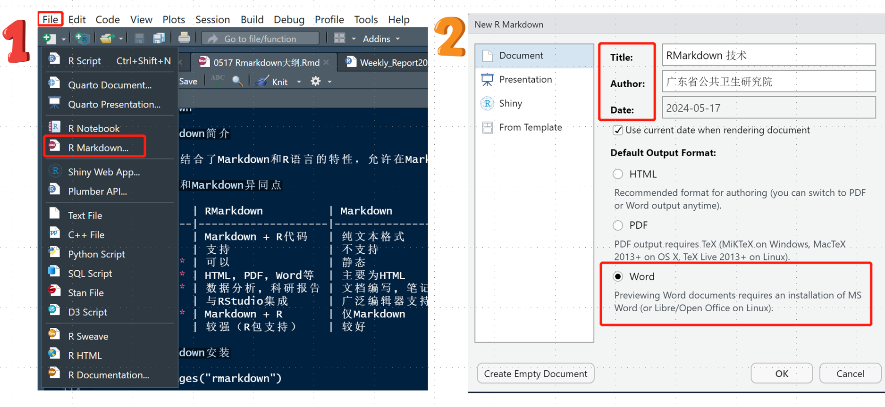
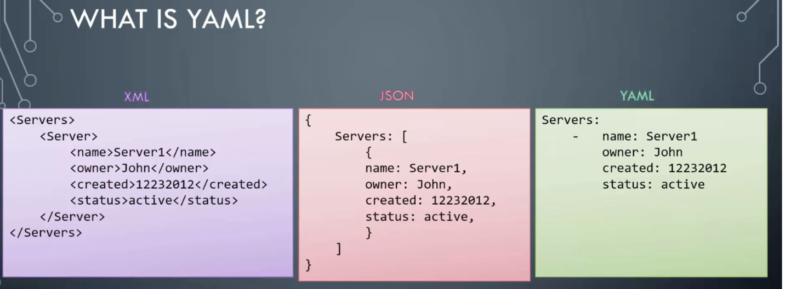
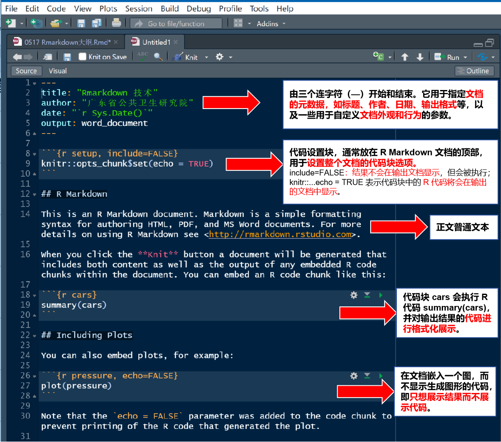
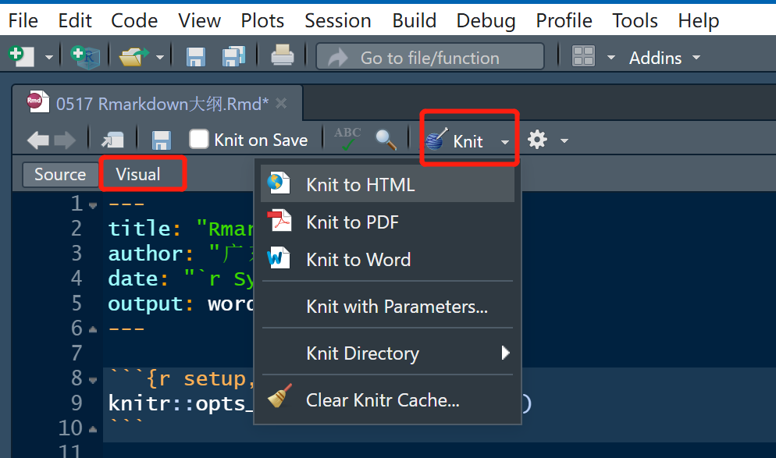

```{r setup, include=TRUE}
```

```{r message=TRUE, warning=TRUE, include=FALSE}
if (!requireNamespace(c("rmarkdown", "tinytex", "DiagrammeR", "prettydoc","rticles","rmdformats","ggplot2", "dplyr"), quietly = TRUE)) {
  install.packages(c("rmarkdown", "tinytex","DiagrammeR", "prettydoc","rticles","rmdformats","ggplot2", "dplyr"))
}
```

# R Markdown培训班课程

## 1. 欢迎与介绍

### 1.1 欢迎致辞

亲爱的学员们，大家好！经过前面一系列精彩的R进阶课程，如meta分析、ggplot2数据可视化、r高级数据管理、以及聚类分析与机器学习等，我相信大家对R语言的强大功能有了更深入的理解。作为这一系列课程的收官之作，今天我们将聚焦于rmarkdown------这一R中至关重要的文档准备和报告编写工具。

### 1.2 课程概览和目标

在前面的课程中，我们学习了如何使用R进行各种高级数据分析和可视化。然而，如何将我们的分析结果和思路清晰地呈现出来，以便与同事、领导或更广泛的受众交流，同样是一个重要的问题。这就是rmarkdown的用武之地。接下来的课程将全面介绍markdown的基本概念、rmarkdown使用方法和最佳实践，帮助大家轻松地将R代码、结果和文本内容整合成一个优雅、专业的文档。

那废话少说，我们直奔主题吧。

## 2. Markdown简介

### 2.1 什么是Markdown

Markdown 是一种**轻量级标记语言**，发明之初的主要目的就是简化HTML内容的书写方式。Markdown 语言在 2004 年由约翰·格鲁伯（John Gruber）创建。Markdown 编写的文档可以导出*HTML、Word、图像、PDF、Epub* 等多种格式的文档，Markdown 编写的文档后缀为 *.md, .markdown*。

Markdown在发明之初的主要目的就是简化HTML内容的书写方式。例如要创建一个列表项，

以下是对比Markdown和HTML书写方式的表格：

+----------------+------------------+-------------------+
| 内容类型       | HTML 书写方式    | Markdown 书写方式 |
+:==============:+:================:+:=================:+
| 列表项         | `<ul>`           | `- 列表项`        |
|                |                  |                   |
|                | `li>列表项</li>` |                   |
|                |                  |                   |
|                | `</ul>`          |                   |
+----------------+------------------+-------------------+
| 引用           | `<blockquote>`   | `> 被引用内容`    |
|                |                  |                   |
|                | `被引用内容`     |                   |
|                |                  |                   |
|                | `</blockquote>`  |                   |
+----------------+------------------+-------------------+

### 2.2 Markdown的优势

Markdown的优势包括：

| 优势点       | 描述                         |
|--------------|------------------------------|
| 简单易学     | 文本标记，无需复杂标签       |
| 跨平台       | 多种系统和编辑器可用         |
| 可读性强     | 清晰明了，易于阅读           |
| 兼容性高     | 可转换为多种格式             |
| 纯文本格式   | 易于移植和版本控制           |
| 写作效率高   | 快速编写，减少排版时间       |
| 自定义性强   | 支持CSS样式自定义            |
| 社区支持丰富 | 教程和工具丰富，易于获取帮助 |

备注：**CSS样式**（Cascading Style Sheets，层叠样式表）是一种用来为结构化文档（如HTML文档或XML应用）添加样式（字体、间距和颜色等）的计算机语言。CSS不仅可以静态地修饰网页，还可以配合各种脚本语言动态地对网页各元素进行格式化。

### 2.3 类似Markdown的工具

除了 Markdown，还有以下一些类似的文本标记语言和编辑器，它们也提供了简洁、易读和跨平台的特性：

| 工具名称      | 简介             | 主要功能               |
|---------------|------------------|------------------------|
| **RMarkdown** | Markdown + R代码 | 嵌入R代码，动态内容    |
| **Typora**    | 所见即所得       | 实时预览，导出多种格式 |
| VS Code       | 代码编辑器       | 实时预览，插件扩展     |
| Haroopad      | 跨平台编辑器     | 实时预览，兼容GFM      |
| Atom          | GitHub文本编辑器 | 语法高亮，插件丰富     |
| Notion        | 笔记应用         | Markdown编辑，任务协同 |

## 3. R Markdown基础

### 3.1 R markdown与markdown异同

R Markdown语法结合了Markdown和R语言的特性，允许在Markdown文档中嵌入R代码，并生成包含R分析和结果的动态文档。

RMarkdown和Markdown异同点

|              | RMarkdown          | Markdown       |
|--------------|--------------------|----------------|
| **定义**     | Markdown + R代码   | 纯文本格式     |
| **R代码**    | 支持               | 不支持         |
| **动态内容** | 可以               | 静态           |
| **输出格式** | HTML, PDF, Word等  | 主要为HTML     |
| **应用场景** | 数据分析, 科研报告 | 文档编写, 笔记 |
| **集成性**   | 与RStudio集成      | 广泛编辑器支持 |
| **涉及知识** | Markdown + R       | 仅Markdown     |
| **扩展性**   | 较强（R包支持）    | 较好           |

### 3.2 R包安装

-   install.packages("rmarkdown") #安装rmarkdown包

-   install.packages("tinytex") \# 安装 tinytex(输出 PDF 格式的文档)

如果 TinyTeX 下载慢，可直接在https://github.com/yihui/tinytex-releases/releases 下载后再安装。

### 3.3 文档创建

**文档创建流程** 安装完成后，在 RStudio 的菜单栏中选择 File -\> New File -\> R Markdown，点击 OK 后， 即可创建一个新的 R Markdown 文档模版

**套用模板创建文档** "From Template"， 是指可以套用一些模板生成统一风格和格式的文档，模板通常包括头部信息（如YAML元数据）、样式表（CSS）以及可能的自定义脚本和HTML代码，映射了特定的标题、页眉、页脚、样式等。推荐下载**prettydoc**、**rmdformats**包获取一些常见的模板。



### 3.4 文档结构

#### 3.4.1 YAML

YAML的全称是 "YAML Ain't Markup Language"。它是一种用于配置文件的可读的数据序列化语言，可理解成是一种存储数据的文件格式，类似json和xml。 通常用于配置文件，如 R Markdown 文档的元数据头部。




**YAML、JSON和XML的主要特点和区别**

图2展示了YAML、JSON和XML呈现形式的区别，下表为详细的特点对比：

表1 YAML、JSON和XML的对比

+----------+------------------------------------------------------------------------------------------------------------------------+--------------------------------------------------------------------------+------------------------------------------------------+----------+
| 特性     | YAML                                                                                                                   | JSON                                                                     | XML                                                  |          |
+==========+========================================================================================================================+==========================================================================+======================================================+==========+
| 英文全称 | YAML (Yet Another Markup Language,为递归缩写) \| JSON (JavaScript Object Notation) \| XML (eXtensible Markup Language) |                                                                          |                                                      |          |
+----------+------------------------------------------------------------------------------------------------------------------------+--------------------------------------------------------------------------+------------------------------------------------------+----------+
| 定义     | 一种可读性高的用来表达资料序列的格式，基于空格和缩进                                                                   | 一种轻量级的文本数据交换格式，使用文本表示一个JavaScript对象或数组的信息 | 一种用于描述、传输和存储数据的语言，强调数据的结构性 |          |
+----------+------------------------------------------------------------------------------------------------------------------------+--------------------------------------------------------------------------+------------------------------------------------------+----------+
| 语法     | 基于空格和缩进                                                                                                         | 基于键值对和嵌套对象/数组                                                | 基于标记（元素）和属性                               |          |
+----------+------------------------------------------------------------------------------------------------------------------------+--------------------------------------------------------------------------+------------------------------------------------------+----------+
| 可读性   | 高，易于人类阅读和编写                                                                                                 | 较高，适合机器解析                                                       | 较低，但适合描述复杂结构                             |          |
+----------+------------------------------------------------------------------------------------------------------------------------+--------------------------------------------------------------------------+------------------------------------------------------+----------+
| 注释     | 支持注释                                                                                                               | 不支持注释                                                               | 支持注释（在某些实现中）                             |          |
+----------+------------------------------------------------------------------------------------------------------------------------+--------------------------------------------------------------------------+------------------------------------------------------+----------+
| 数据类型 | 支持列表、字典等多种数据类型                                                                                           | 支持对象、数组、字符串、数字等                                           | 支持元素、属性、文本等多种数据类型                   |          |
+----------+------------------------------------------------------------------------------------------------------------------------+--------------------------------------------------------------------------+------------------------------------------------------+----------+
| 扩展性   | 较好，易于扩展和定制                                                                                                   | 较好，支持嵌套结构和复杂数据类型                                         | 非常好，可通过标记和属性进行扩展                     |          |
+----------+------------------------------------------------------------------------------------------------------------------------+--------------------------------------------------------------------------+------------------------------------------------------+----------+
| 验证机制 | 依赖实现或外部工具                                                                                                     | 无内置验证机制                                                           | 支持DTD和XML Schema等验证机制                        |          |
+----------+------------------------------------------------------------------------------------------------------------------------+--------------------------------------------------------------------------+------------------------------------------------------+----------+
| 编码格式 | 支持UTF-8等                                                                                                            | 支持UTF-8等                                                              | 支持UTF-8等                                          |          |
+----------+------------------------------------------------------------------------------------------------------------------------+--------------------------------------------------------------------------+------------------------------------------------------+----------+
| 使用场景 | 配置文件、数据交换、存储等                                                                                             | Web开发、API接口、数据存储等                                             | 复杂结构描述、跨平台数据交换、文档类型定义等         |          |
+----------+------------------------------------------------------------------------------------------------------------------------+--------------------------------------------------------------------------+------------------------------------------------------+----------+
| 流行度   | 广泛应用于配置文件等领域                                                                                               | 主流Web开发中的数据交换格式                                              | 逐渐被JSON取代，但在某些领域仍保持优势               |          |
+----------+------------------------------------------------------------------------------------------------------------------------+--------------------------------------------------------------------------+------------------------------------------------------+----------+

备注：递归缩写（Recursive acronym）即递归首字缩写，是一种在全称中递归引用它自己的缩写。在计算机领域黑客社区中，特别是在麻省理工大学，使用这种缩写是一个较早的传统。递归缩写通常包括否定语，用来指出这个缩写指代的事物与另一个事物不相类似，但实际上这个事物通常与另一个事物非常相似甚至是其衍生品。

<!-- 最早的递归缩写命名的实例可能是1977年或1978年出现的TINT编辑器，其命名为“TINT Is Not TECO”（TINT不是文字编辑器和修正器），它是一个MagicSix的编辑器。这启发了麻省理工大学的两个Lisp Machine编辑器的命名，一个叫做EINE（“EINE Is Not Emacs”，EINE不是Emacs），另一个是ZWEI（“ZWEI Was EINE Initially”，ZWEI一开始是EINE）。后来还有Richard Stallman的GNU（GNU's not UNIX，GNU不是UNIX），wine（“Wine Is Not an Emulator”，wine不是一个模拟器），YAML（YAML Ain't a Markup Language，YAML不是一种标记语言）等。这些缩写都以其独特的方式展示了递归缩写的幽默和实用性。 -->

#### 3.4.2 .rmd文档结构

**.rmd主体内容结构**

如图3所示，.rmd主体内容结构一般包括：

    -   YAML文档元数据与设置

    -   普通文本使用Markdown语法

    -   插入R代码块 

各部分内容的简要说明见图3图片备注所示。



### 3.5 文档编译

图4展示了R Markdown 的编译过程，有几个关键步骤：


#### 3.5.1 R Markdown → Markdown（通过knitr）

1.**knitr包的作用**：`knitr`是一个R包，它可以将R代码块从R Markdown文档中提取出来，并在R环境中执行这些代码。

2.**代码执行**：`knitr`执行R代码块，并将输出结果（包括图表、数据表格等）以及可能的错误或警告信息插入到Markdown格式的文本中。

3.**生成Markdown文件**：执行完所有R代码块后，`knitr`会生成一个Markdown格式的文件，其中包含了原始文档的文本内容和代码块的执行结果。

4.**自定义选项**：在R Markdown文档中，可以使用`knitr::opts_chunk$set()`函数来设置代码块的选项，如隐藏代码、设置警告和消息的显示等。

5.点击Knit按钮（等于调用`rmarkdown::render()`）后，R会基于源文档运行结果然后编译。



#### 3.5.2 Markdown → 多种格式文档（通过Pandoc）

1.**Pandoc的作用**：Pandoc是一个强大的文档转换工具，它可读取Markdown格式的文件，并转换为多种不同的文档格式。

2.**输出格式**：通过在R Markdown文档的YAML头信息中指定输出格式，Pandoc可以将Markdown文件转换成HTML、PDF、Word等格式的文档。

3.**转换过程**：Pandoc会读取Markdown文件，并根据指定的输出格式进行转换。例如，转换为PDF时，Pandoc会结合LaTeX模板来生成PDF文档。

4.**自定义模板**：用户可以自定义Pandoc模板，以控制输出文档的样式和布局。

5.**转换参数**：Pandoc提供了丰富的命令行参数，允许用户在转换过程中进行细致的控制。

6.**自动化编译**：RStudio提供了一个"Knit"按钮，可以一键执行整个编译过程，自动运行`knitr`和Pandoc，生成最终的文档。

<!-- 对于 HTML 格式，rmarkdown::render = knitr + Pandoc。 PDF则是多了一步：tinytex 包或其他 LaTeX 发行版编译 Pandoc 生成的 .tex 文件，生成 PDF 文档。 -->

<!-- 1.读取YAML元数据并据此调整输出配置。 -->

<!-- 2.它提取文档中的代码块，使用`knitr`包运行代码并插入结果。`knitr`控制代码执行和结果插入，生成临时`.md`文件。 -->

<!-- 3.R Markdown 利用Pandoc(文档格式转换器)继续转换流程。Pandoc根据YAML头部中的output设置，将.md文件转换为相应格式。同时，Pandoc还读取其他YAML设定，部分插入文档内容（如title），部分作为命令行参数控制转换过程。 -->

## 4. R Markdown语法

### 4.1 标题

使用 `#` 符号来定义标题，`#` 的数量决定了标题的级别。

``` markdown
# 一级标题
## 二级标题
### 三级标题
```

下面为"临床试验药物A与药物B的疗效对比"的例子：

``` markdown
# 临床试验药物A与药物B的疗效对比

## 摘要

  本研究旨在比较药物A和药物B在治疗某种疾病上的疗效。通过对临床试验数据的分析，我们得出了以下结论...

## 数据和方法

### 数据来源

#### 基本信息
#### 基线病情
#### 药物治疗数据
```

### 4.2 段落

在R Markdown中，换行的方式取决于你是在文本中换行还是在代码块中换行。

#### 4.2.1 文本中的换行

**1. 两个空格加回车**

在一行的末尾加上两个空格，然后敲回车。Markdown会将两个空格转换为一个换行。

**示例：**

这是第一行。*空格* *空格* *回车* 这是第二行。

**2. 使用HTML的`<br>`标签**

在需要换行的地方使用`<br>`标签。

**示例：**

这是第一行。\<br\> 这是第二行。

**3. 段落换行**

如果你想开始一个新的段落，只需要在两行文本之间留出一个空行。

**示例：**

``` markdown
这是一个段落。

这是另一个段落。
```

#### 4.2.2 代码块中的换行

在代码块中，通常不需要做特殊处理，因为代码块内的换行会被保留。

**示例：**

```{r echo=TRUE}
# 这是一个R代码块
print("这是第一行输出。") # 这会在控制台输出
print("这是第二行输出。") # 这也会在控制台输出
```

在这个R代码块中，两行print语句会在控制台输出时各自占据一行。

#### 4.2.3 段落或换行的注意事项

-   在R Markdown的普通文本中，连续的空格在渲染时通常会被转换成一个空格，所以如果需要在文本中创建空格效果，可能需要使用非断行空格（`&nbsp;`）或者HTML标签。
-   在R Markdown中，换行符（`\n`）通常不会被识别为换行命令，所以不要在文本中使用`\n`来尝试换行。

### 4.3 列表

-   无序列表使用 `-`、`*` 或 `+` 符号。
-   有序列表使用数字加 `.`。
-   任务列表（GFM扩展）用`- [ ]`或用`- [x]`。

下面是一些应用列表的实例：

#### 4.3.1 无序列表

``` markdown
**公共卫生预防措施**

-   **戴口罩：**在公共场所和人群密集区域佩戴口罩，减少呼吸道传染病的传播。
-   **勤洗手：**定期用肥皂和水洗手，或使用含酒精的手部消毒液。
-   **保持社交距离：**与他人保持至少1米的距离，减少接触传播的风险。
-   **避免聚集：**减少参加大型聚会和活动的次数，降低感染风险。
```

结果显示为：

**公共卫生预防措施**

-   **戴口罩：**在公共场所和人群密集区域佩戴口罩，减少呼吸道传染病的传播。
-   **勤洗手：**定期用肥皂和水洗手，或使用含酒精的手部消毒液。
-   **保持社交距离：**与他人保持至少1米的距离，减少接触传播的风险。
-   **避免聚集：**减少参加大型聚会和活动的次数，降低感染风险。

#### 4.3.2 有序列表

``` markdown
**临床试验阶段**

1.  **预备阶段**：设计试验方案，确定研究对象、干预措施、样本量等。
2.  **招募阶段**：按照试验方案招募受试者，并进行基线评估。
3.  **干预阶段**：对受试者实施干预措施，并记录相关数据。
4.  **随访阶段**：按照试验方案对受试者进行随访，收集干预后的数据。
5.  **数据分析与报告**：对收集到的数据进行统计分析，撰写研究报告或论文。
```

结果显示为：

**临床试验阶段**

1.  **预备阶段**：设计试验方案，确定研究对象、干预措施、样本量等。
2.  **招募阶段**：按照试验方案招募受试者，并进行基线评估。
3.  **干预阶段**：对受试者实施干预措施，并记录相关数据。
4.  **随访阶段**：按照试验方案对受试者进行随访，收集干预后的数据。
5.  **数据分析与报告**：对收集到的数据进行统计分析，撰写研究报告或论文。

#### 4.3.3 任务列表（GFM扩展）

扩展语法GFM（GitHub Flavored Markdown）是GitHub在标准Markdown语法基础上扩展的一系列语法特性，它为开发者提供了更丰富的文本表达方式。GFM支持任务列表（Task Lists）的语法，可用`- [ ]`表示一个未完成的任务，使用`- [x]`表示一个已完成的任务。例如：

``` markdown
**公共卫生应急响应计划**

-   [x] 设立应急响应小组，明确职责和分工。
-   [x] 制定应急响应预案，包括物资准备、人员调配等。
-   [ ] 开展应急演练，检验预案的可行性和有效性。
-   [ ] 监测疫情动态，及时发布预警信息。
-   [ ] 加强国际合作，共同应对全球公共卫生挑战。
```

结果显示为：

**公共卫生应急响应计划**

-   [x] 设立应急响应小组，明确职责和分工。
-   [x] 制定应急响应预案，包括物资准备、人员调配等。
-   [ ] 开展应急演练，检验预案的可行性和有效性。
-   [ ] 监测疫情动态，及时发布预警信息。
-   [ ] 加强国际合作，共同应对全球公共卫生挑战。

任务列表中，可看到哪些任务已经完成（用`- [x]`表示）、尚未完成（用`- [ ]`表示）。

### 4.4 强调

-   粗体文本使用 `**` 或 `__`。
-   斜体文本使用 `*` 或 `_`。

``` markdown
**新药A在治疗高血压方面的疗效显著**。通过一项为期12周的临床试验，我们发现使用新药A治疗的高血压患者，其血压控制率达到了**85%**。与此同时，*患者的生活质量也得到了显著提升*。
```

**新药A在治疗高血压方面的疗效显著**。通过一项为期12周的临床试验，我们发现使用新药A治疗的高血压患者，其血压控制率达到了**85%**。与此同时，*患者的生活质量也得到了显著提升*。

### 4.5 代码块

在R Markdown中，代码块是用来嵌入可执行代码的重要部分。这些代码块可以是R代码、Python代码、SQL查询等，取决于你选择的文档引擎和内核。

#### 4.5.1 使用方法

在R Markdown中，可以使用三个反引号（\`\`\`）来创建一个代码块，并在第一行的反引号后指定代码语言（如`r`、`python`、`sql`等），以便进行语法高亮。

**示例：R代码块**

假设我们想要使用读取cars数据集来进行一些基本的数据分析。下面是一个R代码块的示例：

```{r echo=TRUE}
# 不需要加载额外的R包，因为cars数据集是内置的  
  
# 查看cars数据集的前几行  
head(cars)  
  
# 计算速度（speed）的平均值  
mean_speed <- mean(cars$speed)  
  
# 计算停止距离（dist）的中位数  
median_dist <- median(cars$dist)  
  
# 输出结果  
cat("速度（speed）的平均值为：", mean_speed, "\n")  
cat("停止距离（dist）的中位数为：", median_dist, "\n")  
  
# 绘制速度与停止距离的关系图  
plot(cars$speed, cars$dist, main = "Speed vs Stopping Distance", xlab = "Speed (mph)", ylab = "Stopping Distance (ft)", pch = 19)
```

在这个示例的结果部分，使用cat函数输出了速度的平均值和停止距离的中位数，然后用plot函数绘制了一个散点图，展示了速度与停止距离之间的关系。图表的主标题设置为"Speed vs Stopping Distance"，x轴标签为"Speed (mph)"，y轴标签为"Stopping Distance (ft)"，并且使用点字符pch = 19来表示数据点。

**示例：Python代码块**

虽然R Markdown主要用于R代码，但也可以嵌入Python代码块。假设我们想要使用Python的pandas库来分析同样的数据集，代码块可能如下：

```{python eval=FALSE}
# 导入pandas库
import pandas as pd

# 读取数据集（这里假设数据集名为vaccine_data.csv）
vaccine_data = pd.read_csv("vaccine_data.csv")

# 筛选已接种疫苗的人群
vaccinated_group = vaccine_data[vaccine_data['vaccine_status'] == '已接种']

# 计算已接种疫苗人群的平均年龄
mean_age_vaccinated = vaccinated_group['age'].mean()

# 输出结果
print(f"已接种疫苗人群的平均年龄为：{mean_age_vaccinated}")
```

#### 4.5.2 代码块属性

RMarkdown文件中的R代码可以单独执行，也可以作为一个整体执行。代码块的执行结果可以直接嵌入到Markdown文本中，或者作为独立的代码块输出。

RMarkdown中的代码块可以通过设置不同的参数来控制代码的执行和输出，以下是一些常用的代码块属性：

-   `echo`：控制代码是否显示在文档中。
-   `eval`：决定代码是否被执行。
-   `results`：设置执行结果的显示方式。
-   `warning`、`message`、`error`：分别控制警告、消息和错误信息的显示。
-   `cache`：允许代码块的结果被缓存，以提升性能。

#### 4.5.3 R 代码执行与输出

-   在 R Markdown 文档中，可以直接嵌入 R 代码，并展示其输出。

``` markdown
{r echo=FALSE, message=TRUE, warning=TRUE}
x <- c(1, 2, 3)
mean(x)
```

```{r echo=FALSE, message=TRUE, warning=TRUE}
# 隐藏代码（echo=FALSE）和消息（message=FALSE）
x <- c(1, 2, 3)
mean(x)
```

例子中，`echo=FALSE` 表示不显示代码本身，`message=FALSE` 表示不显示 R 运行时的消息。

### 4.6 链接

在R Markdown中，创建超链接的基本语法是使用方括号`[]`包围链接文本，紧接着使用圆括号`()`包围链接地址。这种语法可以在文档中直接添加指向其他网页、文档或资源的链接，使内容更加丰富和具有交互性。

假设我们正在撰写一篇关于"新冠病毒疫苗接种效果分析"的R Markdown文档，并想引用世界卫生组织（WHO）发布的最新报告。我们可以使用以下语法来创建一个链接：

``` markdown
根据[世界卫生组织（WHO）的最新报告](https://www.who.int/publications/m/item/weekly-epidemiological-update---23-august-2023)，新冠病毒疫苗的接种效果在不同人群中有所差异。
```

输出结果为： 根据[世界卫生组织（WHO）的最新报告](https://www.who.int/publications/m/item/weekly-epidemiological-update---23-august-2023)，新冠病毒疫苗的接种效果在不同人群中有所差异。

在示例中，链接文本是"世界卫生组织（WHO）的最新报告"，而链接地址是`https://www.who.int/publications/m/item/weekly-epidemiological-update---23-august-2023`，读者可以点击这个链接，直接访问WHO发布的最新报告，获取更详细的信息。

除了引用外部资源，你还可以使用链接来跳转到文档的其他部分。这对于长篇文档来说非常有用，可以帮助读者快速定位到感兴趣的内容。例如，你可以使用以下语法来创建一个指向文档中某个章节的链接：

`关于R markdown与markdown的对比，请参见[3.1 R markdown与markdown异同](###%203.1%20R%20markdown与markdown异同)。`

关于R markdown与markdown的对比，请参见[3.1 R markdown与markdown异同](###%203.1%20R%20markdown与markdown异同)。

在这个示例中，链接文本是"3.1 R markdown与markdown异同"，而链接地址是一个特殊的标识符`### 3.1 R markdown与markdown异同`。这个标识符对应于文档中某个标题的ID，通过点击这个链接，读者可以快速跳转到该标题所在的位置。

### 4.7 图片

在R Markdown中，图片的插入同样和链接类似，非常简单且直观。

图片可能用于展示网络或本地图像、数据可视化结果、流程图等。以下是一些具体的示例和语法：

#### 4.7.1 插入网络图片

如果有一个图片的有效网络连接（即图片的URL），可以直接使用以下语法来插入它：

``` markdown

```

例如，如果想插入一张展示新冠病毒传播路径的流程图，你可以这样做：

``` markdown

```

输出结果为：


#### 4.7.2 插入本地图片

如果有一个保存在本地文件夹中的图片，可以使用相对路径或绝对路径来引用它。由于绝对路径在不同的环境下可能无法有效加载图片，所以推荐使用相对路径。

相对路径是相对于你的R Markdown文件所在的位置的路径。例如，如果你的R Markdown文件在`C:/Users/YourName/Documents/Project`文件夹中，而你的图片在`C:/Users/YourName/Documents/Project/Images`文件夹中，那么你可以使用以下语法来插入图片：

``` markdown

```

注意，这里的`Images/your-image.png`就是相对于R Markdown文件的相对路径。

#### 4.7.3 插入R代码块生成的图片

下面案例为使用 R 绘图函数（如 `plot()`、`ggplot2` 等）在 R Markdown 中创建图表，并直接在文档中展示。

**疾病防控案例：传染病监测数据**

```{r echo=TRUE, message=FALSE, warning=FALSE}

# 加载需要的库（这里不需要ggplot2或dplyr，但为了完整性，我保留了它们的加载）
library(ggplot2); library(dplyr)

# 创建2023年1月1日到2023年12月31日每天对应的新增病例数数据框
daily_cases <- data.frame(
  Date = seq.Date(from = as.Date("2023-01-01"), to = as.Date("2023-12-31"), by = "day"),
  Cases = rpois(365, 50)  # 生成365个随机数，均值为50的泊松分布
)


# 使用 base R 绘简单的线图
plot(x = daily_cases$Date, y = daily_cases$Cases, type = 'l',
     xlab = "日期", ylab = "新增病例数",
     main = "某种传染病每日新增病例数")

# 使用 ggplot2 绘图
library(ggplot2)
ggplot(data = daily_cases, aes(x = Date, y = Cases)) +
  geom_line() +
    scale_x_date(breaks = "2 month", date_labels = "%Y-%B") +  # 设置X轴日期格式
  labs(title = "某种传染病每日新增病例数", x = "日期", y = "新增病例数") +
  theme_minimal()
```

**临床案例：治疗方法对患者生存率的影响**

下面这个案例展示某种治疗方法对患者生存率的影响：假设我们有另一个数据框treatment_data，其中包含不同治疗方法（Treatment）和相应的患者1年生存率（SurvivalRate）。

```{r echo=TRUE}

# 假设的治疗数据
treatment_data <- data.frame(
  Treatment = factor(c("Treatment A", "Treatment B", "Control")),
  SurvivalRate = c(0.80, 0.90, 0.60)
)

# 生成图表
library(ggplot2)
ggplot(treatment_data, aes(x = Treatment, y = SurvivalRate)) +
  geom_bar(stat = "identity", fill = "darkorange") +
  labs(title = "Effect of Treatment on Patient Survival Rate",
       x = "Treatment",
       y = "Survival Rate") +
  theme_minimal()
```

在 R Markdown 中创建流程图或甘特图，可以用 R 包如 `mermaid.js`，或 `ggplot2`、`DiagrammeR` 等来生成图形。

**使用ggplot2 包创建甘特图**

```{r echo=TRUE, message=FALSE, warning=FALSE}

library(ggplot2);library(dplyr)
# 创建项目活动数据
activities <- data.frame(
  Activity = c("数据收集与整理", "数据分析", "结果整理与报告撰写", "项目总结与建议提出"),
  Start = as.Date(c("2024-07-01", "2024-08-01", "2025-01-01", "2025-04-01")),
  End = as.Date(c("2024-12-31", "2024-12-31", "2025-03-31", "2025-06-30"))
)

# 重排 Activity 列，使其按照 Start 列的值降序排列  
activities <- activities %>%  
  mutate(Activity = factor(Activity, levels = unique(Activity)[order(Start, decreasing = T)]))  

# 绘制甘特图
gantt_chart <- ggplot(activities, aes(x = Start, xend = End, y = Activity)) +
  geom_segment(aes(color = Activity), size = 14) +  # 绘制活动条形
  scale_x_date(breaks = "2 months", date_labels = "%Y-%m") +  # 设置X轴日期格式
  theme_minimal() +  # 使用简洁主题
  labs(title = "项目进度甘特图", x = "日期", y = "活动")

# 打印甘特图
print(gantt_chart)
```

**使用DiagrammeR 包创建流程图**

```{r echo=TRUE, message=FALSE, warning=FALSE}
library(DiagrammeR)

# 安装并加载 DiagrammeR 包
if (!requireNamespace("DiagrammeR", quietly = TRUE)) {
  install.packages("DiagrammeR")
}


# 定义 Mermaid 图表代码
mermaid_code <- '
graph TD
    A[健康女性 <br> --不同年龄] --> B[HPV疫苗接种 <br> --不同策略组合]
    B --> C{疫苗覆盖型别}
    C -->|长期免疫保护| D[健康]
    C -->|未覆盖型别感染| E[其他HPV型别感染]
    E --> F[无症状或轻微症状]
    E --> G[发展为LSIL]
    G --> H[自然消退或治疗]
    G --> I[发展为HSIL]
    G --> O
    I --> J{HSIL进展}
    J -->|自然消退或治疗| K[健康]
    J -->|持续存在| L[发展为子宫颈癌]
    L --> N[子宫颈癌治愈]
    L --> M[死于子宫颈癌]
    N --> O[自然死亡]
    J --> O
    H --> O
    B --> O
    F --> O
    K --> O
    D --> O

'

# 使用 DiagrammeR 包的 mermaid() 函数渲染图表
mermaid(mermaid_code)

```

#### 4.7.4. 调整图片大小

虽然Markdown本身并不直接支持调整图片大小的功能，但可以通过添加`fig.width`和`fig.height`等属性，或者通过HTML标签来实现。

**通过fig.x属性调整图片大小** 如下是在R Markdown代码块中添加`fig.width`和`fig.height`这两个属性来调整图片大小。

```markdown
{r treatment-survival-plot, echo=FALSE, fig.height=3, fig.width=4}
# 假设的治疗数据
treatment_data <- data.frame(
  Treatment = factor(c("Treatment A", "Treatment B", "Control")),
  SurvivalRate = c(0.80, 0.90, 0.60)
)

# 生成图表
library(ggplot2)
ggplot(treatment_data, aes(x = Treatment, y = SurvivalRate)) +
  geom_bar(stat = "identity", fill = "darkorange") +
  labs(title = "Effect of Treatment on Patient Survival Rate",
       x = "Treatment",
       y = "Survival Rate") +
  theme_minimal()
```

```{r treatment-survival-plot, echo=FALSE, fig.height=3, fig.width=4}
# 假设的治疗数据
treatment_data <- data.frame(
  Treatment = factor(c("Treatment A", "Treatment B", "Control")),
  SurvivalRate = c(0.80, 0.90, 0.60)
)

# 生成图表
library(ggplot2)
ggplot(treatment_data, aes(x = Treatment, y = SurvivalRate)) +
  geom_bar(stat = "identity", fill = "darkorange") +
  labs(title = "Effect of Treatment on Patient Survival Rate",
       x = "Treatment",
       y = "Survival Rate") +
  theme_minimal()
```

在这个代码块中，`{r treatment-survival-plot, fig.width=4, fig.height=3}`这部分是R Markdown的"代码块标签"。在这个标签中，`treatment-survival-plot`是代码块的名称，而`fig.width=4`和`fig.height=3`则是设置图片宽度和高度的属性。这些属性将影响由该代码块生成的图片的大小。

注意，这些尺寸是以英寸为单位的，但也可以使用其他单位，如厘米（cm）或像素（px），只需将数字后面的单位更改为你想要的即可。例如，`fig.width=10cm`或`fig.height=500px`。

**通过HTML标签调整图片大小**

``` markdown

```

在这个示例中，`style="width:50%;height:auto;"`用于设置图片的宽度为50%（相对于其容器的宽度），并自动调整高度以保持图片的原始比例。

### 4.8 表格

可以在 R Markdown 中用 R 代码来直接定义、编写表格，或导入/生成表格。

**R代码生成表格**

在Markdown中，你可以使用管道符（\|）和短横线（-）来定义一个简单的表格。以下为直接用R markdown生成标题"临床患者数据（部分）"的表格。

``` markdown
| 患者ID | 年龄 | 性别 | 诊断结果 | 治疗方法 |
|:------:|:----:|:----:|:--------:|:--------:|
|   1    |  25  |  男  |   癌症   |   手术   |
|   2    |  32  |  女  |  糖尿病  | 药物治疗 |
|   3    |  48  |  男  |  心脏病  | 搭桥手术 |
|   4    |  18  |  女  |   哮喘   |  吸入器  |
|   5    |  55  |  男  |   中风   | 物理治疗 |
```

输出结果为：

| 患者ID | 年龄 | 性别 | 诊断结果 | 治疗方法 |
|:------:|:----:|:----:|:--------:|:--------:|
|   1    |  25  |  男  |   癌症   |   手术   |
|   2    |  32  |  女  |  糖尿病  | 药物治疗 |
|   3    |  48  |  男  |  心脏病  | 搭桥手术 |
|   4    |  18  |  女  |   哮喘   |  吸入器  |
|   5    |  55  |  男  |   中风   | 物理治疗 |

**R代码生成表格**

```{r echo=TRUE, message=TRUE, warning=TRUE}
# 手动创建一个临床医学数据示例
clinical_data <- data.frame(
  患者ID = 1:5,
  年龄 = c(25, 32, 48, 18, 55),
  性别 = c("男", "女", "男", "女", "男"),
  诊断结果 = c("癌症", "糖尿病", "心脏病", "哮喘", "中风"),
  治疗方法 = c("手术", "药物治疗", "搭桥手术", "吸入器", "物理治疗")
)

# 使用 knitr::kable() 函数来生成Markdown格式的表格
knitr::kable(clinical_data, caption = "临床患者数据（部分）", format = "markdown")
```

使用 knitr::kable() 函数来生成Markdown格式的表格。 knitr::kable() 是一个用于生成美观表格的函数，它将数据框(data.frame)或矩阵(matrix)转换为Markdown格式，使得表格在R Markdown文档中能够以整洁的格式呈现。caption 参数用于为表格添加标题。

**R代码来导入表格**

```{r echo=TRUE, message=FALSE, warning=FALSE}
# 安装并加载readxl包（如果尚未安装）  
# install.packages("readxl")  
library(readxl)  
  
# 导入Excel文件  
Cars_excel_data <- read_excel("tables/Cars Data.xlsx")  
  
# 查看数据的前几行  
head(Cars_excel_data)
```

### 4.9 数学公式

RMarkdown 支持使用 LaTeX 语法来插入数学公式。

RMarkdown 文档中，用 `$$` 符号来插入 LaTeX 格式的数学公式。

GAM 的基本公式可以表示为：

$$ g(E[Y|X]) = \alpha + f_1(x_1) + f$$$$_2(x_2) + \ldots + f_p(x_p) $$

其中：

-   $Y$ 是响应变量（例如，某种疾病的发病率）。
-   $X = (x_1, x_2, \ldots, x_p)$ 是预测变量（例如，年龄、性别、环境因素等）。
-   $g(\cdot)$ 是连接函数，它定义了响应变量的期望值与模型预测值之间的关系。常见的连接函数包括恒等函数（用于线性回归）、对数函数（用于泊松回归）等。
-   $f_1, f_2, \ldots, f_p$ 是平滑函数，它们捕获了响应变量与每个预测变量之间的非线性关系。这些平滑函数可以是任何形状，从而允许模型适应复杂的数据模式。
-   $\alpha$ 是截距项。

当渲染时，LaTeX 公式将被转换为专业的数学表达式。

### 4.10 分页符和分割线

在 R Markdown中，分页符和分割线（或称为水平线）是两个不同的概念，但都可以在文档中用来改善可读性和布局。

-   分页符

在 R Markdown 中，通常没有直接的分页符语法来强制在输出文档（如 PDF）中进行分页。但是，当生成 PDF 时，我们可能希望使用 LaTeX 的功能来实现分页。但是，请注意，这通常是在我们使用的特定 R Markdown 模板（如 pandoc 的 LaTeX 模板）中控制的，而不是直接在 R Markdown 文档中。

如果用像 bookdown 这样的R包来编写书籍或长文档，则可以使用 `\newpage` 或 `\clearpage` 在 LaTeX 输出中强制分页。

-   分割线

用 HTML 或 Markdown 的语法来添加分割线。以下是示例：

``` markdown
---

这是一条分割线。

或用三个或更多的连字符、星号或下划线来创建一条水平线：

***

或者

---

或者

___
```

上述这些都将在生成的文档（ HTML、PDF 等）中显示为一条水平线（注意，这些水平线在纯文本输出（如 Markdown 文件）中可能无法正确显示）。

### 4.11 导出文档与分享

RMarkdown 文件可导出为多种格式，包括 HTML、Word、PDF 等。以下是如何使用 RMarkdown 导出这些格式的详细说明：

**1.导出 HTML**

(1)**确保指定输出格式为HTML**：在文件的 YAML 头部中，设置 `output` 为 `html_document`。可以进一步定制输出选项，如选择主题、添加 CSS 样式等。

``` yaml
---
title: "RMarkdown 示例"
author: "你的名字"
date: "2024年5月22日"
output: html_document
---
```

**2.导出 HTML**

可以点击 RStudio 工具栏上的 "Knit" 按钮（或使用快捷键 Ctrl + Shift + K），选择 "Knit to HTML"。这将生成一个 HTML 文件，在浏览器中打开。

或者，通过如下代码：

```{rmarkdown eval=FALSE, include=FALSE}
rmarkdown::render(input = "Rmarkdown课件.Rmd", 
                   output_format = "html_document", 
                   output_file = "output/output.html")
```

**3.导出 Word**

(1)**修改输出格式**：在 YAML 头部中，将 `output` 设置为 `word_document`。

``` yaml
---
title: "RMarkdown 示例"
author: "你的名字"
date: "2024年5月22日"
output: word_document
---
```

(2)**编写和导出**：编写.rmd内容后，点击 "Knit" 按钮，选择 "Knit to Word"。这将生成一个 Word 文件。

**4.导出 PDF**

要导出为 PDF，通常需要使用 `pdf_document` 或 `latex_document` 格式，并通过 LaTeX 编译器（如 pandoc 或 XeLaTeX）进行转换。

(1)**确保已安装 LaTeX 等编译器**： LaTeX ，MiKTeX ，MacTeX 等。

(2)**修改输出格式**：在 YAML 头部中，将 `output` 设置为 `pdf_document` 或 `latex_document`。

``` yaml
---
title: "RMarkdown 示例"
author: "你的名字"
date: "2024年5月22日"
output: pdf_document
---
```

**5.导出其他格式**

RMarkdown 还支持其他输出格式，如 PowerPoint（`powerpoint_presentation`）、幻灯片（`slidy_presentation`、`revealjs::revealjs_presentation`、`beamer_presentation`）、电子书（`epub_document`）等。我们可以通过修改 YAML 头部中的 `output` 字段来指定你想要的输出格式。然后，使用 "Knit" 按钮来生成对应的文件。

请注意，某些格式可能需要额外的依赖项或工具链来正常工作。例如，要导出为电子书，可能需要安装 Calibre 或其他电子书编辑工具。

### 4.12其他

| 标题 | RMarkdown代码案例 | 简单说明 |
| --- | --- | --- |
| 目录 | `yaml---`<br>`toc: true # 为HTML输出添加目录`<br>`toc_float: true # 使目录浮动在侧边` | 在YAML头部添加`toc: true`以在HTML输出中添加目录 |
| 参考文献 | `yaml---`<br>`bibliography: references.bib # 指定参考文献数据库`<br>`---在文档中引用文献：[@citation_key]` | 使用`.bib`文件为PDF输出添加参考文献 |
| 交叉引用 | `markdown# 图表交叉引用`{r my_plot, fig.cap="我的图标题", fig.label="fig:my_plot"}<br>`plot(1:10)`<br>`请看图[图 @fig:my_plot]。` | 使用图表的`fig.label`进行交叉引用 |
| 索引 | (不适用RMarkdown原生支持) | 需要LaTeX的`\index{}`和`\printindex`命令 |
| 动画 | `html<video width="320" height="240" controls>`<br>`<source src="animation.mp4" type="video/mp4">Your browser does not support the video tag.</video>` | 在HTML输出中嵌入动画视频 |
| 交互组件 | (不适用直接RMarkdown代码，但可以使用Shiny) | 使用Shiny包创建交互组件并嵌入到RMarkdown中 |
| 音频和视频 | `html<audio controls>`<br>`<source src="audiofile.mp3" type="audio/mpeg">Your browser does not support the audio element.</audio>`<br>`html<video width="320" height="240" controls>`<br>`<source src="videofile.mp4" type="video/mp4">Your browser does not support the video tag.</video>` | 在HTML输出中嵌入音频和视频 |

注意：索引部分在RMarkdown中不直接支持，通常需要使用LaTeX来生成。对于交互组件，虽然RMarkdown本身不支持直接创建，但可以通过嵌入Shiny应用等方式实现。

## 5. R Markdown 应用与拓展

### 5.1 科研文章撰写

R Markdown增强了研究的透明度，便于复现实验过程与结果。通过结合R代码和Markdown文本，你可以轻松地编写和分享科研文章。

    -   APA Style

    -   Chicago Style

    -   Harvard Style

    -   IEEE Style

    -   MLA Style

    -   Vancouver Style

    -   Custom Templates

### 5.2 数据分析与报告

允许一体化完成数据处理、分析、可视化及报告编写。可以直接在文档中嵌入R代码块，R Markdown将自动运行这些代码并展示结果。

### 5.3 技术文档编制

可结合代码示例，为软件包、算法提供清晰说明，帮助更好地理解和使用技术产品。

### 5.4 动态演示文稿

使用R Markdown和特定的包（如xaringan），你可以创建互动式幻灯片，提升演讲与教学效果。你的幻灯片将包含动态图表和可交互的元素，使你的演示更加生动和有趣。

### 5.5 网页与书籍建设

可以用于构建网站和出版电子书或教材。用R Markdown编写网页内容，并通过GitHub Pages等平台发布网站。同时，也可以使用Bookdown包编写书籍，并通过在线平台或印刷出版分享知识。

### 5.6 拓展功能

- **交互式可视化:**Shiny应用程序集成

R Markdown与Shiny结合，可以创建高度交互的数据应用程序。用户可以通过界面操作影响数据展示和分析结果，适用于复杂数据分析展示和决策支持系统。

- **多媒体内容集成:**音频与视频嵌入

R Markdown支持在文档中嵌入音频、视频内容。可以轻松地在文档中插入多媒体元素，制作多媒体教程或报告，增加信息传递的丰富度和趣味性。

- **协作与版本控制：**Git与GitHub集成

利用Git进行版本控制，结合GitHub或其他Git托管服务，可以方便地团队协作编写文档，追踪更改历史，提高工作效率。

- **自动化报告与工作流：**自动化报告生成

结合持续集成/持续部署(CI/CD)工具，如GitHub Actions，可以实现数据更新后自动重新运行分析并更新报告，保持文档的时效性。

- **参数化报告**

使用R Markdown参数化功能，可以通过外部参数文件或命令行输入来定制报告内容。这适用于个性化报告需求或批量生成不同条件下的分析结果。

- **数据科学沟通工具:**RPubs与Blogdown

通过RPubs发布分享R Markdown作品，或者使用Blogdown建立个人博客，可以方便地与其他专家进行交流和知识传播。

## 6. 课程总结与问答

### 6.1 主要概念回顾

在本次R Markdown培训班中，我们学习了以下关键概念和部分应用：

#### R Markdown 基础

-   **R Markdown与Markdown的异同点**。
-   **R包安装：**rmarkdown和tinytex。
-   **文档创建与结构：**YAML头信息、Markdown语法、R代码块。
-   **文档编译：**从R Markdown到Markdown，再到多种格式文档。
-   **文档发布与分享：**通过多种渠道/方式（github、个人网页等）共享

#### R Markdown 语法

标题、段落、列表、强调、链接、图片、代码块、表格、图表、数学公式等。

#### R Markdown 应用场景

-   **科研文章撰写：**增强研究透明度，便于复现实验过程与结果。
-   **数据分析与报告：**一体化完成数据处理、分析、可视化及报告编写。
-   **技术文档编制：**结合代码示例，为软件包、算法提供清晰说明。
-   **动态演示文稿：**创建互动式幻灯片，提升演讲与教学效果。
-   **网页与书籍建设：**构建网站和出版电子书或教材。

#### 扩展功能

-   **交互式可视化：**Shiny集成。
-   **多媒体内容集成：**音频与视频嵌入。
-   **协作与版本控制：**Git与GitHub集成(本次课不涉及)。
-   **自动化报告与工作流：**自动化报告生成(参考实操案例)。
-   **参数化报告：** 数据科学(参考实操案例)。

### 6.2 课程总结

通过今天的培训，我们深入了解了R Markdown的强大功能和灵活性。R Markdown不仅是一种文档编写工具，更是一种数据分析、科研、教学和沟通的解决方案。它允许我们将代码、数据和文本整合在一起，创建动态、可重复和易于分享的文档。

随着技术的不断发展，R Markdown和类似的工具将继续作为临床、公卫、IT和其他众多行业的重要工具。我们鼓励大家在实际工作中尝试使用R Markdown、Typora和其他类似工具，以提高工作效率和文档质量。

## 7. 附录

### 7.1 推荐阅读

**《R Markdown: The Definitive Guide》** - 这是官方R Markdown指南，详细介绍了R Markdown的各个方面，适合初学者和希望深入了解的高级用户。

**《R Markdown Cookbook》** - <https://bookdown.org/yihui/rmarkdown-cookbook/> - 有较多案例，应用为主。

**《Dynamic Documents with R and knitr》** - knitr是R Markdown背后的核心技术之一，适合想要在R中生成动态报告的用户。

**《bookdown: Authoring Books and Technical Documents with R Markdown》** - 专注于如何使用R Markdown和bookdown包编写书籍和长文档。

**李东风的《R语言教程》** 也不错，通俗易懂，非常适合入门。

### 7.2 在线资源

国内的有B站、如统计之都、CSDN 等，提供了丰富的 R Markdown 使用案例和技巧，国外在线资源有：

**RStudio官方文档** - [R Markdown Documentation](https://rmarkdown.rstudio.com/) - RStudio提供全面的R Markdown在线文档，包括用户指南、示例和常见问题解答。

**Cheatsheets** - [RStudio Cheat Sheets](https://www.rstudio.com/resources/cheatsheets/) - RStudio的cheatsheets提供了快速参考，帮助用户快速回顾R Markdown的基本语法和命令。

**Stack Overflow** - [R Markdown Tag](https://stackoverflow.com/questions/tagged/rmarkdown) - Stack Overflow上的R Markdown标签可寻找具体问题的解决方案。

**GitHub Repositories** - [R Markdown Related Repositories](https://github.com/search?q=r+markdown) - GitHub上有大量的R Markdown相关仓库，包括模板、插件和示例项目。

### 7.3 R Markdown社区

**RStudio Community** - [RStudio Community Forum](https://community.rstudio.com/) - RStudio社区论坛可讨论R Markdown及其他RStudio产品问题。

**Local R User Groups** - [R User Groups](https://www.r-users.com/) - 加入本地的R用户组参与研讨。

**Conferences and Workshops** - [UseR! Conference](https://user2024.r-project.org/), [RStudio Conference](https://www.rstudio.com/conference/) - 在线参加R相关的会议和研讨会，如UseR和RStudio Conference。

## 8. 致谢与讨论

现在，我们已经完成了本次培训的主要内容，感谢大家的参与。接下来，我们进入问答和操作环节。如果有任何疑问，待会我和助教会为您提供解答。
